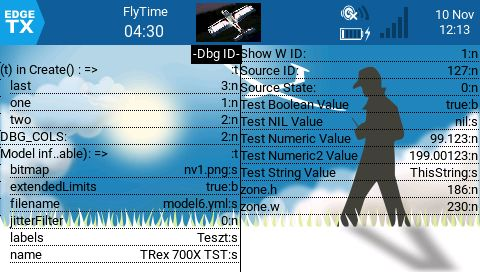

# DbgDemo

Ez egy egyszerű minta program arra, hogyan használhatot a Dbg widget-et.

Kizárólag TX16S rádióadón működik!

Használatához először telepítened kell a Dbg widgetet.
https://github.com/Be-Gab/Dbg

További részletek a Dbg widget leírásában.

##Figyelmeztetések!
Az add() függvénnyel hozzáadott változók nem követik a változók értékének változását, csupán megjelenítik az adott ponton hordozott értéket. A változót különböző cimkékkel (msg) többször is meg lehet jeleníteni a program különböző pontjain hozzáadva a dbg ablakhoz.

Ne használd a Dbg widget-et éles környezetben, kizárólag a Companion programban, fejlesztési időben használd!